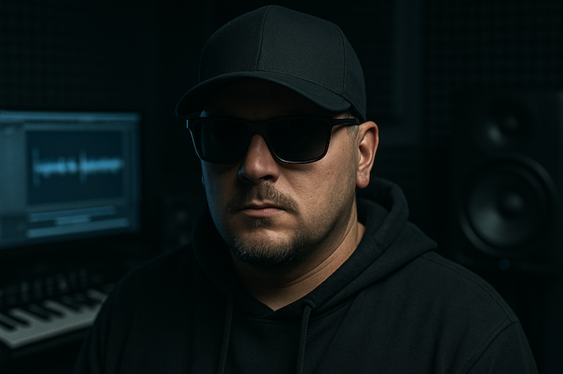

<!DOCTYPE html>
<html lang="de">
<head>
    <meta charset="UTF-8" />
    <meta name="viewport" content="width=device-width, initial-scale=1.0" />
    <title>COREREC - electronic music creations</title>

    
</head>

<body id="top">

    <!-- HEADER -->
    <header>
        
COREREC

        <nav class="main-menu">
            <ul>
                <li><a href="#home">Home</a></li>
                <li><a href="#releases">Releases</a></li>
                <li><a href="#artists">Artists</a></li>
                <li><a href="#shop">Shop</a></li>
                <li><a href="#contact">Contact</a></li>
            </ul>
        </nav>

        

            
            
            
        

    </header>

    <!-- SECTIONS -->
    <section id="home">
        <h2>Welcome to COREREC</h2>
        

            
        

        
Electronic music creations – hard, dark, industrial, cinematic.

    </section>

    <section id="releases">
        <h2>Latest Releases</h2>
        

            
        

        
Here you will find all EPs, singles and collaborations.

    </section>

    <section id="artists">
        <h2>Artists</h2>
        

            
        

        
The creators behind the COREREC sound.

    </section>

    <section id="shop">
        <h2>Shop</h2>
        

            
        

        
Merch, downloads and more coming soon.

    </section>

    <section id="contact">
        <h2>Contact</h2>
        

            
        

        
For booking, releases or collaborations – get in touch.

    </section>

    <footer>
        © 2025 COREREC – All rights reserved.
    </footer>

    <!-- Scroll to top on load robust -->
    

</body>
</html>
